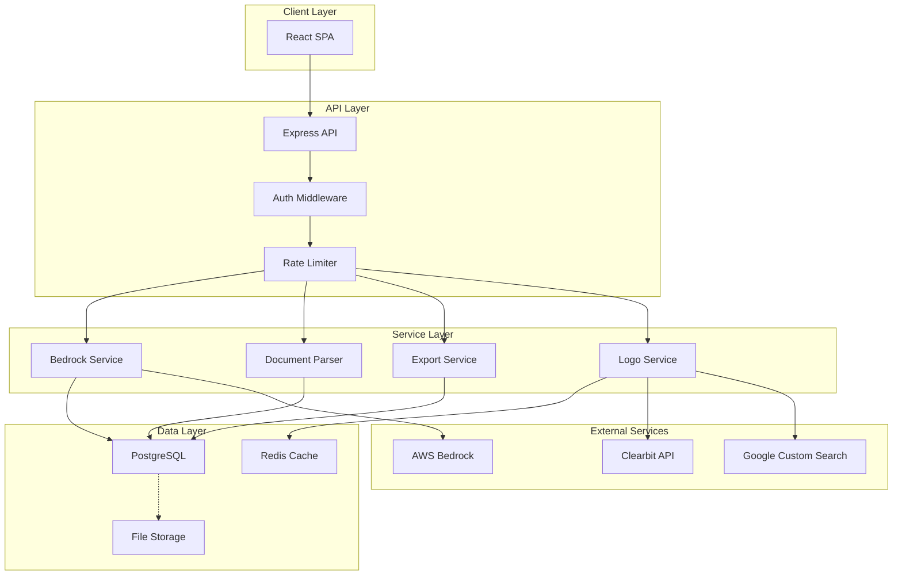
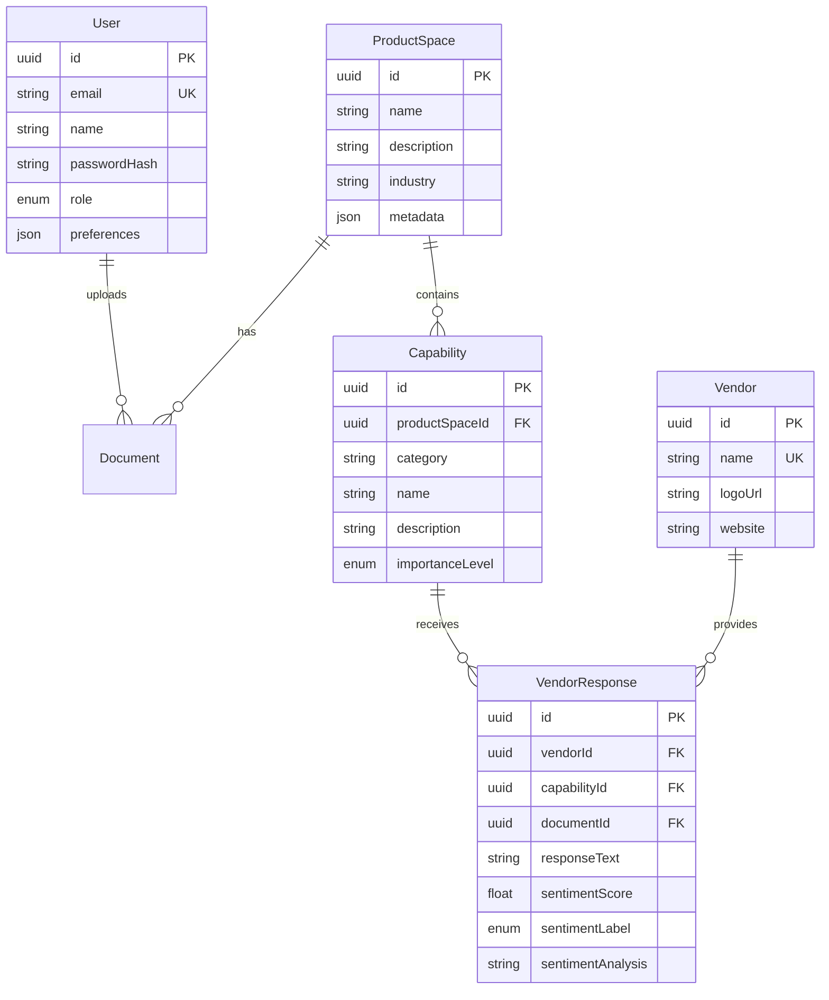
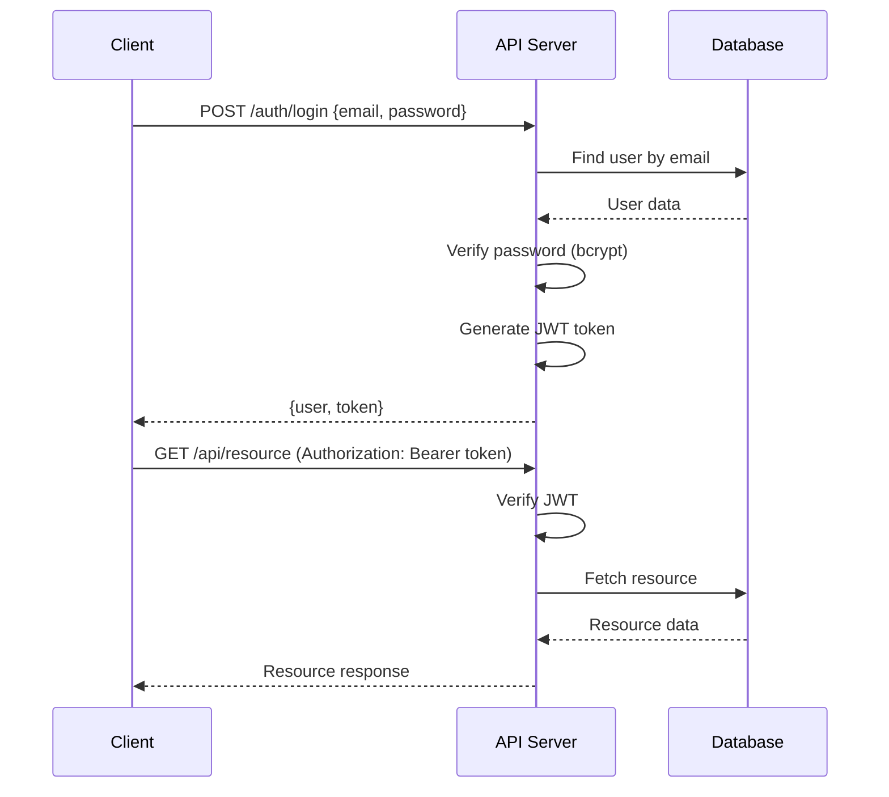
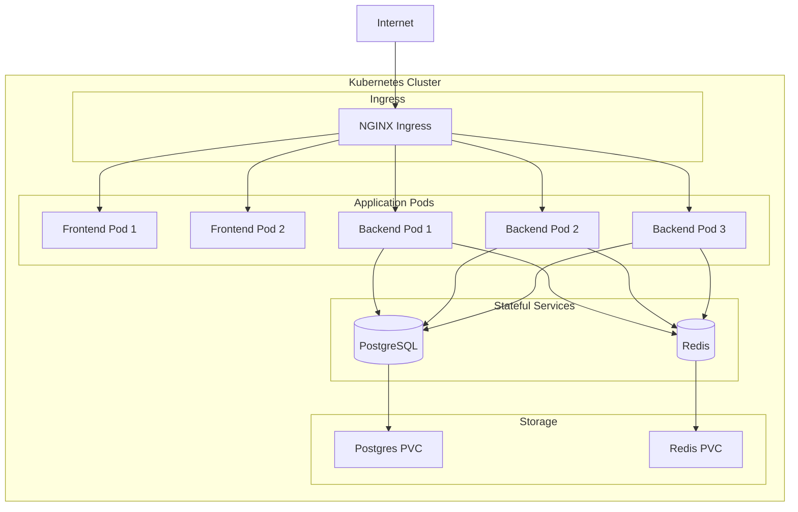

# Architecture Documentation

## System Architecture

### Overview

The Enterprise Capabilities Intelligence Platform follows a modern three-tier architecture with microservices principles, containerization, and cloud-native design patterns.



## Components

### Frontend (React + TypeScript + Mantine UI)

**Technology Stack:**
- React 18 with TypeScript
- Mantine UI v7 for components
- Tanstack Query for data fetching
- Zustand for state management
- React Router for navigation

**Key Features:**
- Server-side state synchronization
- Optimistic UI updates
- Real-time data refresh
- Responsive design
- Dark/light theme support

**Pages:**
1. **Dashboard** - Product space overview with cards
2. **Product Space Detail** - Capability management
3. **Competitive Intelligence** - Comparison matrix
4. **Settings** - AWS Bedrock configuration

### Backend (Node.js + Express + TypeScript)

**Technology Stack:**
- Express.js for HTTP server
- TypeScript for type safety
- Prisma ORM for database access
- Pino for structured logging
- JWT for authentication

**Layered Architecture:**

```
Controllers (HTTP handlers)
    ↓
Services (Business logic)
    ↓
Repositories (Data access via Prisma)
    ↓
Database (PostgreSQL)
```

**Key Services:**

1. **Bedrock Service**
   - AWS SDK integration
   - Sentiment analysis
   - Capability update suggestions
   - Result caching

2. **Document Parser Service**
   - Excel/CSV parsing
   - Intelligent column detection
   - Data normalization
   - Error handling

3. **Export Service**
   - Matrix generation
   - RFI template creation
   - Format conversion (Excel/CSV)

4. **Vendor Logo Service**
   - Multi-source logo fetching
   - Clearbit integration
   - Google Custom Search fallback
   - Placeholder generation
   - Redis caching

### Database Schema



### Caching Strategy

**Redis Implementation:**

1. **Sentiment Analysis Results**
   - Key: `sentiment:{hash(capability:vendor:response)}`
   - TTL: 24 hours
   - Invalidation: Manual or on re-upload

2. **Vendor Logos**
   - Key: `vendor-logo:{hash(vendorName)}`
   - TTL: 30 days
   - Invalidation: Manual refresh

3. **Capability Update Suggestions**
   - Key: `capability-updates:{hash(productSpaceId)}`
   - TTL: 1 hour
   - Invalidation: On capability change

## Security Architecture

### Authentication Flow



### Security Layers

1. **Network Layer**
   - HTTPS/TLS encryption
   - CORS configuration
   - Rate limiting

2. **Application Layer**
   - JWT authentication
   - Role-based authorization
   - Input validation (Joi/Zod)
   - SQL injection prevention (Prisma)
   - XSS protection

3. **Data Layer**
   - Encrypted credentials storage
   - Password hashing (bcrypt)
   - Secure session management

## Deployment Architecture

### Kubernetes Architecture



### Scaling Strategy

**Horizontal Pod Autoscaling:**
- Backend: 2-10 pods based on CPU/Memory
- Frontend: 2-5 pods based on traffic
- Database: Single instance with replication (future)

**Resource Allocation:**
```yaml
Backend:
  Requests: 512Mi memory, 500m CPU
  Limits: 1Gi memory, 1000m CPU

Frontend:
  Requests: 128Mi memory, 100m CPU
  Limits: 256Mi memory, 200m CPU
```

## Performance Optimization

### Frontend Optimizations

1. **Code Splitting**
   - Route-based splitting
   - Vendor bundle separation
   - Lazy loading

2. **Caching**
   - React Query caching
   - Browser cache headers
   - Service Worker (future)

3. **Bundle Optimization**
   - Tree shaking
   - Minification
   - Gzip compression

### Backend Optimizations

1. **Database**
   - Indexed queries
   - Connection pooling
   - Query optimization

2. **Caching**
   - Redis for expensive operations
   - In-memory caching
   - CDN for static assets

3. **API**
   - Response compression
   - Pagination
   - Selective field loading

## Monitoring & Observability

### Logging

**Structured Logging with Pino:**
```typescript
{
  level: 'info',
  timestamp: '2024-01-01T00:00:00.000Z',
  msg: 'Request completed',
  req: { method: 'GET', url: '/api/v1/product-spaces' },
  res: { statusCode: 200 },
  responseTime: 45
}
```

### Health Checks

- `/api/v1/health` - Application health
- Database connectivity check
- Redis connectivity check
- Liveness probe: Every 30s
- Readiness probe: Every 10s

## Disaster Recovery

### Backup Strategy

1. **Database Backups**
   - Daily automated backups
   - 30-day retention
   - Point-in-time recovery

2. **Configuration Backups**
   - Version-controlled (Git)
   - Secret management (Kubernetes Secrets)

3. **Recovery Procedures**
   - Database restore: < 1 hour RPO
   - Full system restore: < 4 hours RTO

## Future Enhancements

1. **Microservices Migration**
   - Split backend into domain services
   - API Gateway pattern
   - Service mesh (Istio)

2. **Advanced Analytics**
   - Time-series data
   - Historical trending
   - Predictive analytics

3. **Real-time Features**
   - WebSocket integration
   - Live collaboration
   - Real-time notifications
